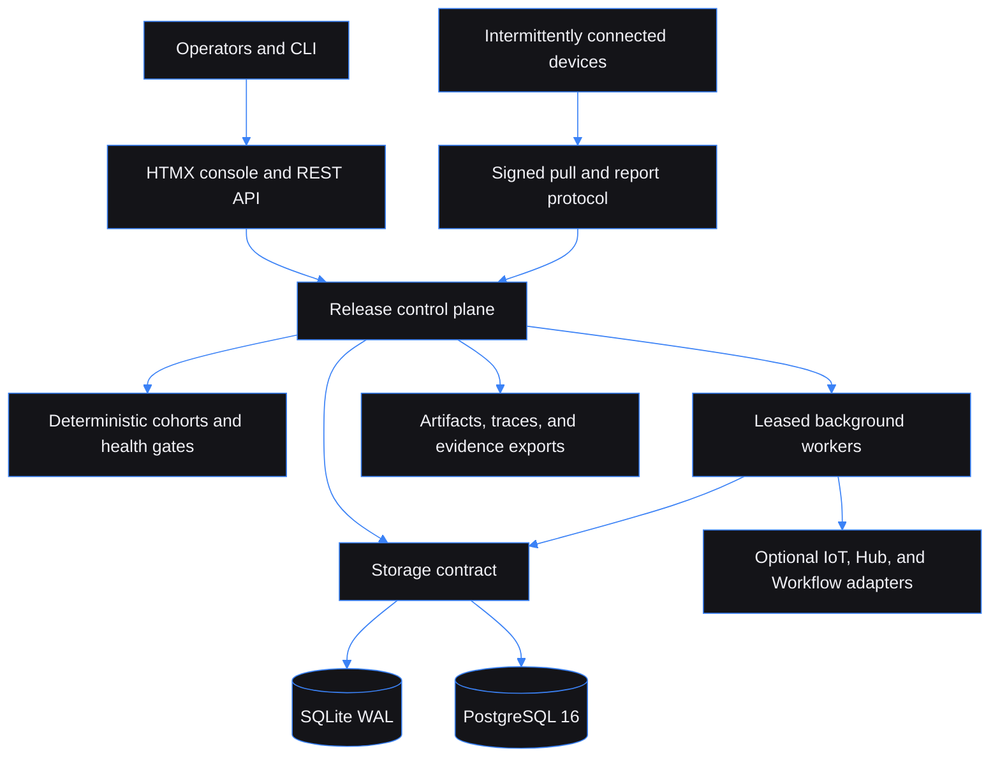

# Edge Fleet Rollout Safety Control Plane — Safe staged releases for intermittently connected devices

Built by [Kingsley Onoh](https://kingsleyonoh.com) · Systems Architect

## The Problem

Edge devices disappear behind NAT, reconnect out of order, repeat reports, and acknowledge commands before they have actually converged. Edge Fleet gives operators one tenant-scoped system that freezes signed artifacts, policies, cohorts, approvals, commands, observations, and evidence before exposure changes. Its release gate plans 10,000-device cohorts in under two seconds and limits the reference universal 20% install-failure scenario to at most 2.5% unhealthy exposure instead of an all-at-once 100% blast radius.

## Architecture



## Key Decisions

- I chose outbound device polling over inbound remote control because edge devices are often offline or behind NAT.
- I chose observed generation plus artifact digest over delivery acknowledgement because transport success does not prove deployment convergence.
- I chose fixed `1%, 5%, 20%, 50%, 100%` waves over adaptive cohort sizing because frozen inputs must replay to byte-identical decisions.
- I chose SQLite and local artifact storage over mandatory distributed infrastructure because the complete release, simulation, replay, and evidence path must run on one machine.
- I chose fail-closed optional adapters over direct third-party side effects because an integration outage must never remove pause, abort, or rollback authority from the local control plane.

## Setup

### Prerequisites

- CMake 3.30 or newer
- A C++23 compiler and Ninja
- Git and a pinned vcpkg checkout exposed through `VCPKG_ROOT`
- Node.js 20.11–22 only for Playwright browser tests
- Docker Desktop only for the PostgreSQL production profile

### Installation

```bash
git clone https://github.com/kingsleyonoh/edge-fleet-rollout-safety-control-plane.git
cd edge-fleet-rollout-safety-control-plane
cmake --preset dev
cmake --build --preset dev -j 2
```

On Windows, run the CMake commands from a Visual Studio Developer Command Prompt. Executables use the `.exe` suffix there.

### Environment

```bash
cp .env.example .env
```

The standalone development defaults work without editing `.env`. Setup generates missing runtime secrets once in ignored, owner-only `local-secrets/runtime.env`. Production rejects blank or development-generated secrets.

| Group | Variables | Purpose |
|---|---|---|
| Runtime | `EDGEFLEET_ENV`, `EDGEFLEET_HOST`, `EDGEFLEET_PORT`, `EDGEFLEET_PUBLIC_URL`, `EDGEFLEET_LOG_LEVEL`, `EDGEFLEET_LOG_FORMAT`, `EDGEFLEET_WORKER_ENABLED`, `EDGEFLEET_WORKER_CONCURRENCY` | Listener, public URL, logging, and worker settings |
| Tenant | `SELF_REGISTRATION_ENABLED`, `DEFAULT_TENANT_NAME`, `DEFAULT_TENANT_LEGAL_NAME`, `DEFAULT_TENANT_TIMEZONE` | First-run tenant identity and registration policy |
| Security | `SESSION_ENCRYPTION_KEY`, `CREDENTIAL_ENCRYPTION_KEY`, `CURSOR_HMAC_KEY`, `TRUSTED_PROXY_CIDRS`, `PRIVATE_ADAPTER_CIDRS` | Session, credential, cursor, proxy, and private-network trust |
| Storage | `STORAGE_BACKEND`, `SQLITE_PATH`, `SQLITE_BUSY_TIMEOUT_MS`, `DATABASE_URL`, `DATABASE_POOL_SIZE`, `POSTGRES_DB`, `POSTGRES_USER`, `POSTGRES_PASSWORD` | SQLite standalone storage or PostgreSQL production storage |
| Files | `ARTIFACT_STORE_PATH`, `ARTIFACT_TEMP_PATH`, `ARTIFACT_MAX_BYTES`, `ARTIFACT_MIN_FREE_BYTES`, `TRACE_STORE_PATH`, `EXPORT_STORE_PATH` | Artifact, trace, temporary, and evidence-export locations and limits |
| Release | `DEFAULT_STAGE_PERCENTAGES`, `DEFAULT_MIN_OBSERVATION_SECONDS`, `DEFAULT_TELEMETRY_FRESHNESS_SECONDS`, `DEFAULT_CONVERGENCE_TARGET`, `DEFAULT_MAX_OFFLINE_FRACTION`, `COMMAND_EXPIRY_SECONDS` | Fixed waves, gate windows, freshness, convergence, and command expiry |
| Simulation | `SIMULATOR_MAX_DEVICES`, `SIMULATOR_MAX_EVENTS`, `SIMULATOR_WORKER_CONCURRENCY`, `BENCHMARK_CORPUS_PATH`, `REPLAY_CHECKPOINT_INTERVAL` | Bounded simulation, benchmark, and replay execution |
| IoT adapter | `IOT_AGGREGATOR_ENABLED`, `IOT_AGGREGATOR_URL`, `IOT_AGGREGATOR_API_KEY`, `IOT_AGGREGATOR_REQUIRED_FOR_PROMOTION`, `IOT_AGGREGATOR_FIXTURE_MODE` | Optional external health evidence; disabled by default |
| Notification adapter | `NOTIFICATION_HUB_ENABLED`, `NOTIFICATION_HUB_URL`, `NOTIFICATION_HUB_API_KEY`, `NOTIFICATION_HUB_FIXTURE_MODE` | Optional release and safety event delivery; disabled by default |
| Workflow adapter | `WORKFLOW_ENGINE_ENABLED`, `WORKFLOW_ENGINE_URL`, `WORKFLOW_ENGINE_API_KEY`, `WORKFLOW_ENGINE_WORKFLOW_ID`, `WORKFLOW_ENGINE_FIXTURE_MODE` | Optional non-authoritative playbook execution; disabled by default |
| Observability | `METRICS_BIND_HOST`, `METRICS_PORT`, `OTEL_EXPORTER_OTLP_ENDPOINT`, `SENTRY_DSN` | Dedicated Prometheus listener and optional exporters |

### Run

```bash
build/dev/edgefleet setup
build/dev/edgefleet serve
```

Open [http://localhost:8080/login](http://localhost:8080/login) and exchange the one-time setup API key for a browser session. Prometheus metrics are served separately on `http://127.0.0.1:9090/metrics` by default.

## How It Works

1. An operator registers fleets and devices, signs target and rollback artifacts, and activates a fixed-wave policy.
2. Release validation freezes membership, artifact manifests, policy version, cohort salt, and rollback capability.
3. A different operator approves the captured action when four-eyes control is required.
4. Devices poll for durable desired state and report immutable observations through signed requests.
5. The gate evaluator counts only fresh observations with the expected generation and digest, then promotes, pauses, aborts, or rolls back.
6. Every accepted mutation and decision commits with a tenant-specific hash-chained evidence event that can be verified, replayed, and exported.

## Usage

### Fastest path: local operator console

```bash
# Prints the bootstrap API key once and seeds the default safety policy
build/dev/edgefleet setup

# Starts the API, console, metrics listener, and background worker loop
build/dev/edgefleet serve
```

Then follow the shipped operator journey:

1. Sign in at `/login` with the one-time API key.
2. Create a fleet and register devices.
3. Upload and validate target and rollback artifacts.
4. Draft a release, freeze its cohort, and submit it for approval.
5. Watch stage gates, pause or roll back when needed, then verify or export the evidence chain.

### API examples

Check core readiness without authentication:

```bash
curl http://localhost:8080/health/ready
```

```json
{"artifact_store":true,"database":true,"evidence_store":true,"runtime_secrets":true,"status":"ready"}
```

Register a tenant when self-registration is enabled. The API key is returned once:

```bash
curl -X POST http://localhost:8080/api/tenants/register \
  -H 'Content-Type: application/json' \
  -d '{"name":"edge-demo","legal_name":"Edge Demo Ltd","display_name":"Edge Demo","timezone":"UTC"}'
```

```json
{"tenant":{"id":"...","name":"edge-demo"},"api_key":"...","warning":"Store this API key now. The secret is not shown again."}
```

Read fleet inventory and immutable evidence with the tenant API key:

```bash
export EDGEFLEET_API_KEY='the-one-time-key'
curl -H "Authorization: Bearer $EDGEFLEET_API_KEY" http://localhost:8080/api/fleets
curl -H "Authorization: Bearer $EDGEFLEET_API_KEY" http://localhost:8080/api/evidence
```

Run deterministic local analysis without the HTTP server:

```bash
build/dev/edgefleet simulate --scenario fixtures/scenarios/healthy-10k.json --seed 42
build/dev/edgefleet benchmark --corpus fixtures/benchmarks/v1/manifest.json
build/dev/edgefleet evidence --verify
build/dev/edgefleet replay-recovery
```

### What it handles

| Concern | Edge Fleet behavior |
|---|---|
| Offline devices | Durable pull commands remain available until expiry or supersession |
| Duplicate and reordered reports | Idempotent immutable reports never move projections backward |
| Blast radius | Deterministic fixed waves expose devices gradually |
| False convergence | Only matching observed generation and digest count |
| Human control | Version-bound, expiring, two-person approvals protect sensitive transitions |
| Failed integrations | Local safety actions continue; required external evidence fails closed |
| Audit proof | Hash-chained evidence, checkpoints, replay, and bounded NDJSON exports |

The OpenAPI document contains the complete 77-path contract, including device HMAC endpoints, release controls, approvals, simulation, replay, integrations, health, and metrics.

## Tests

```bash
ctest --preset dev --output-on-failure

npm ci
npm run test:e2e -- --workers=1 --project=chromium --project=mobile

docker build --target production --tag edgefleet:verification .
```

The audited release evidence records 63/63 Docker-free CTest cases, 64/64 production-image cases with two explicit environment-dependent skips, six Playwright journeys, a 100-device five-stage standalone release, and a byte-identical 10,000-device cohort check across 100 input shuffles.

## AI Integration

This project includes machine-readable context for AI tools:

| File | What it does |
|---|---|
| [`llms.txt`](llms.txt) | Project summary for language models ([llmstxt.org](https://llmstxt.org)) |
| [`AGENTS.md`](AGENTS.md) | Codebase instructions for AI coding agents |
| [`openapi.yaml`](openapi.yaml) | OpenAPI 3.1 API specification |
| [`mcp.json`](mcp.json) | MCP server definition for AI IDEs |

### Cursor / Other AI IDEs

Point your AI agent at `AGENTS.md` for the full codebase contract.

## Deployment

The production packaging is complete, but no public deployment is currently verified. The Compose profile runs a migration job, PostgreSQL 16, and the non-root Edge Fleet application behind an external Traefik network.

### Production Stack

| Component | Role |
|---|---|
| `migrate` | Applies the selected PostgreSQL migrations before startup |
| `app` | Runs the non-root, read-only API, console, workers, health checks, and metrics |
| `postgres` | Stores tenant-scoped operational state and immutable facts |
| Named volumes | Retain PostgreSQL data, artifacts, traces, temporary uploads, and exports |
| Traefik | Terminates public TLS outside this Compose project when deployed |

### Self-Host

```bash
cp .env.example .env
# Set production secrets and POSTGRES_PASSWORD in .env.
docker compose -f docker-compose.prod.yml --profile production up -d --build
```

The application container runs as UID/GID `10001:10001`, uses a read-only root filesystem, and exposes application and metrics listeners on ports 8080 and 9090 inside its networks.

<!-- THEATRE_LINK -->
